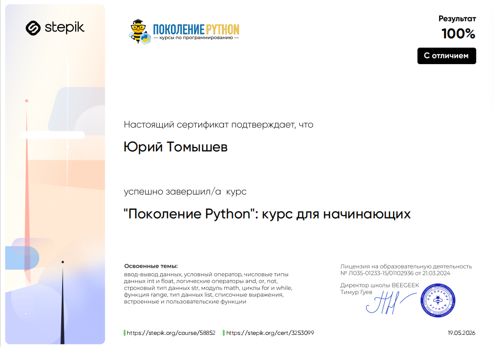
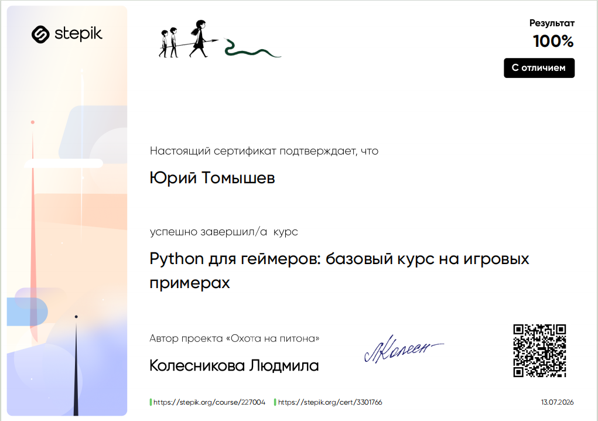
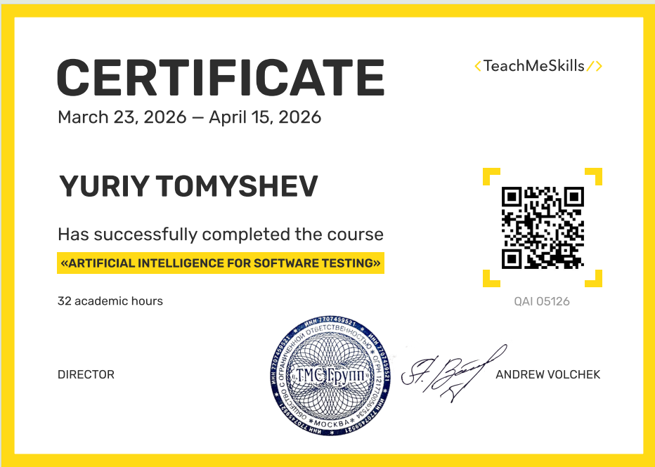
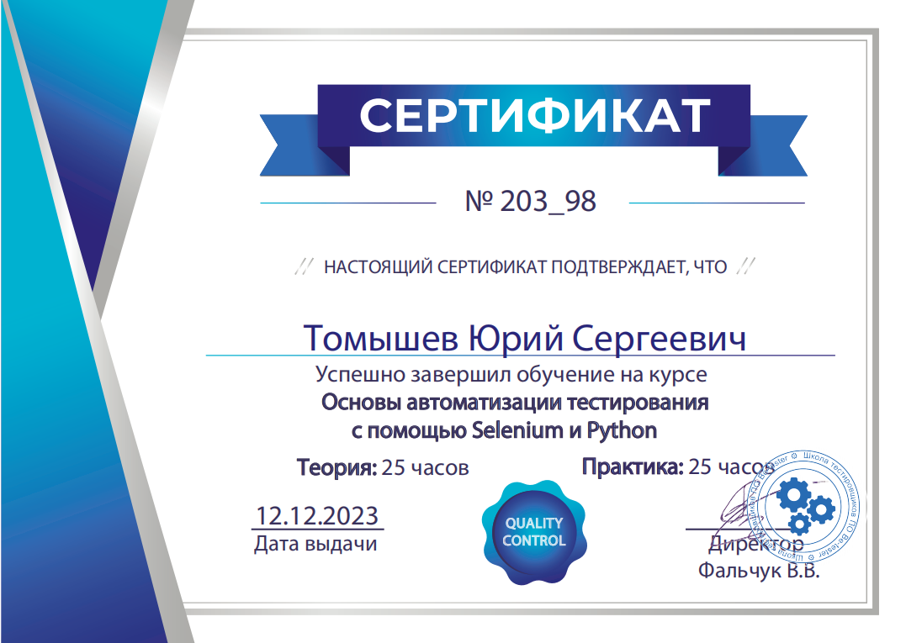
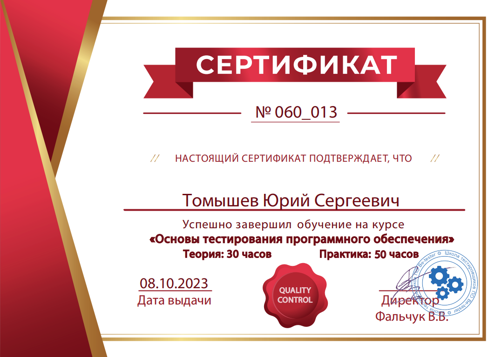
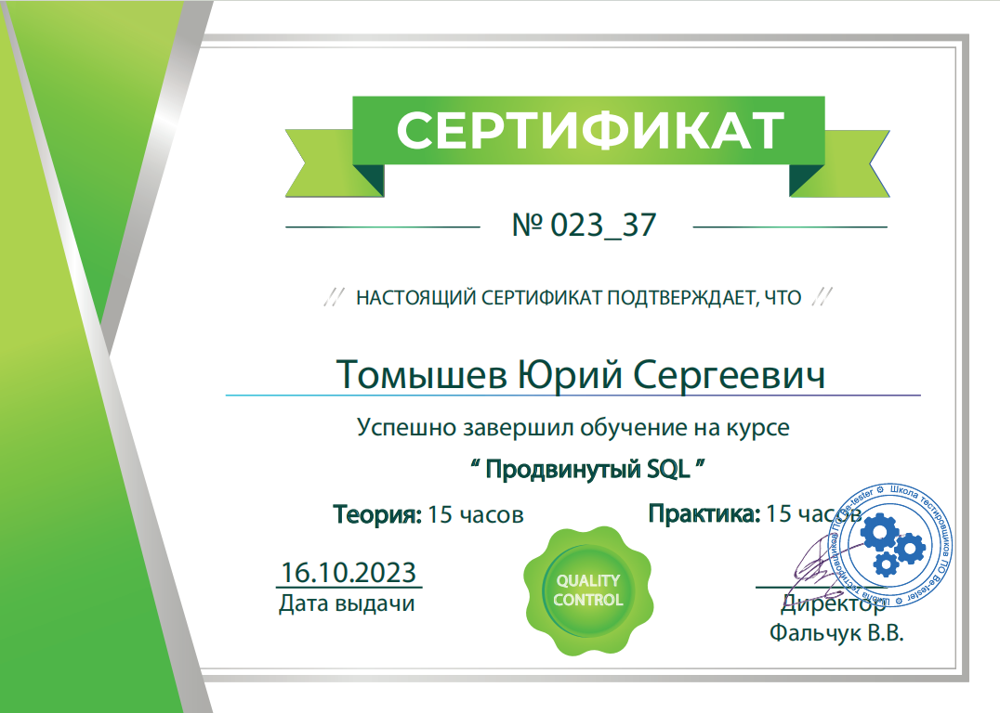

# Мои сертификаты и подтверждения навыков

Здесь собраны сертификаты, которые подтверждают мои навыки в области тестирования, Python и AI.

---

## Python

### «Поколение Python: курс для начинающих»

### «Python для геймеров: базовый курс на игровых примерах»

---

## Автоматизация и AI

### «QA + AI» — TeachMeSkills, 2026

---

## Тестирование и SQL

### «Основы автоматизации тестирования с помощью Selenium и Python» — Be-Tester, 2023

### «Основы тестирования программного обеспечения» — Be-Tester, 2023

### «Продвинутый SQL» — Be-Tester, 2023

---

## Проекты на GitHub

- [AI_python_test](https://github.com/YuriySeTo/AI_python_test) — автоматизация тестирования с интеграцией LLM
- [dify-qa-pipeline](https://github.com/YuriySeTo/dify-qa-pipeline) — AI-агент на Dify + Gemini
- [phasmophobia_game](https://github.com/YuriySeTo/phasmophobia_game) — текстовая игра на Python

---

*Обновлено: июль 2026*